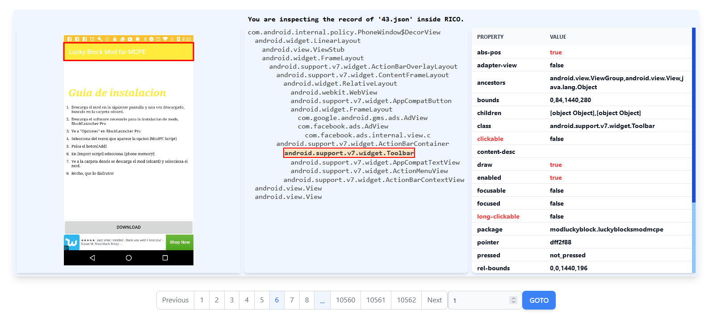

# RICO-Inspector
A basic web tool for inspecting view tree of RICO.

You should clone this repo after you download all the necessary data from RICO: https://interactionmining.org/rico

TO REMIND: This tool is for inspecting `UI Screenshots and View Hierarchies` of RICO.

## How to run this code.

1. Specify the path to `UI Screenshots and View Hierarchies` of RICO on your PC in `server.py`
1. python server.py
2. yarn
3. npm start
4. Voilà

## And the UI would be like...

Click the node inside the tree panel in the middle and start inspecting!!

Enjoy it!